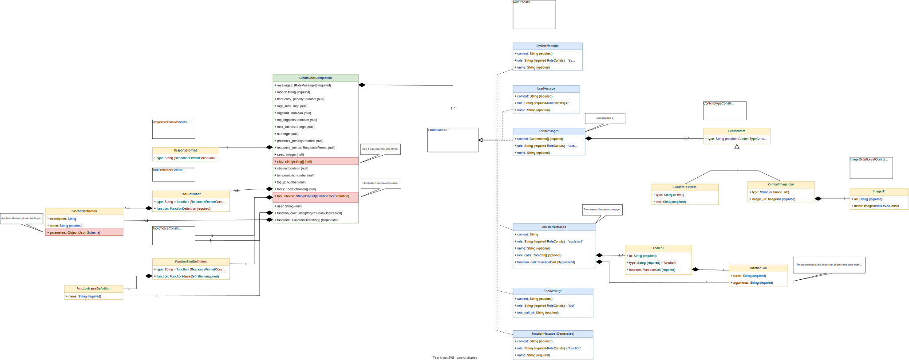
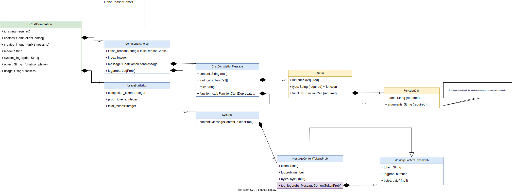
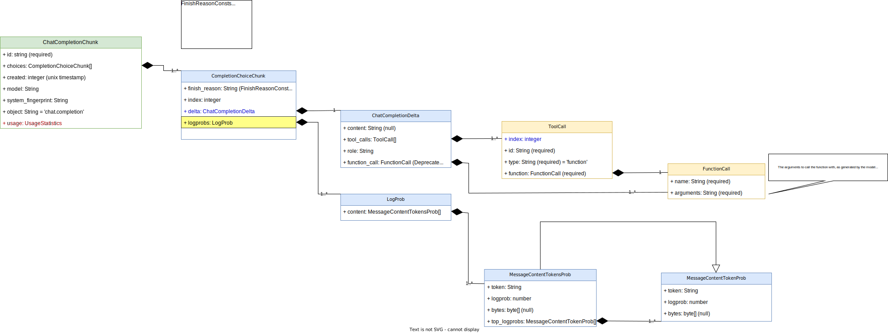

# DevExtremeAI

## Overview

DevExtremeAI is a library with full and complete implementation of all OpenAI's APIs.
This library is fully compliant to openAI specs and also implement openAI error response.
It's very easy to use with asp.net core and has full support to dependency injection (with a single line of code as asp.net standard pattern).
It's also easy to use  in libraries without dependency injection (see samples below).

*Please note that this is **unofficial** OpenAPI library* (It's not mantained by OpenAI Company).

## Build Status

| Build | Status | Current Version |
| ------ | ------ | ------ |
| CI | [](https://github.com/AndreaPic/DevextremeAI/actions/workflows/dotnet-ci.yml) | N/A
| Packages | [](https://github.com/AndreaPic/DevExtremeAI/actions/workflows/dotnet-ci-cd.yml) | 

## How to use

To use this library you need OpenAI api key (and optionally organization id).
To obtain the api key you have to register your account to openai.com.
After registered go to your OpenAI Account and search 'View API keys', in this page you can create your apikey.
From your account page you can find the Settings page where is placed your organization ID.

You can use this library via [nuget package DevExtremeAI](https://www.nuget.org/packages/DevExtremeAI/)

**Important**
Note that this library support dot net IConfiguration and dependency injection so it can read apikey and organization from them instead of hard coding in source code. (Please don't hard code apikey and organization id in source code and don't push them to git or any source repository).

## Specs

This library fully adhere to OpenAI specs and its object model is the same of OpenAI (with dotnet peculiarities).
This library also implement OpenAI error codes that aren't documented in OpenAI's APIs Reference.

### Asp.net core using examples

Install [nuget package DevExtremeAI](https://www.nuget.org/packages/DevExtremeAI/)
In Program.cs add this using:

```csharp
using DevExtremeAI.AspNet;
```

This using allow you to use the asp.net service extension.
With the webapplication builder now you can use the `AddDevExtremeAI()` method that register all that you need with dependency injection.

### Using web application settings

```csharp
  var builder = WebApplication.CreateBuilder(args);

  // Add services to the container.
  builder.Services.AddDevExtremeAI();
```

This `AddDevExtremeAI()` overload looks for the apikey in appsettings.json or appsettings.Development.json so you can avoid to hardcode them in source code. I suggest you to use GitHub Action Secrets.

### Using environment variables

```csharp
  var builder = WebApplication.CreateBuilder(args);

  // Add services to the container.
  builder.Services.AddDevExtremeAI<DevExtremeAI.Settings.CurrentEnvironmentData>();
```

In this way api key and organization id are readed from environment variables named OPENAI_ORGANIZATION and OPENAI_API_KEY.

### Using your implementation

```csharp
  var builder = WebApplication.CreateBuilder(args);

  // Add services to the container.
  builder.Services.AddDevExtremeAI<MyEnvironmentReader>();
```

In the above example you can use the overload `AddDevExtremeAI<TEnvironment>` that require an object type that implement the `DevExtremeAI.Settings.IAIEnvironment` interface so you can read apikey or organization id from where you want. (Your implementation of `IAIEnvironment` will be used in singleton way).

### Explicit arguments

Finally you can use the overload `AddDevExtremeAI(string apiKey, string? organization)` and pass apikey and organization id values readed from where you want (please read them from where you want but don't hardcode in any source code).

That's all! From now you can use OpenAI in your asp.net project via Dependency Injection.

### Your api

Now you can declare the constructor of your controller & friends with `DevExtremeAI.OpenAIClient.IOpenAIAPIClient` argument like this:

```csharp
  private DevExtremeAI.OpenAIClient.IOpenAIAPIClient _openAIApiClient;
  public TestAIController(DevExtremeAI.OpenAIClient.IOpenAIAPIClient openAIApiClient)
  {
      _openAIApiClient = openAIApiClient;
  }
```

an example of use of IOpenAIAPIClient in controller or apicontroller could be:

```csharp
  // GET api/<TestAIController>/5
  [HttpGet("{id}")]
  public async Task<string> Get(int id)
  {
      var chat = new CreateChatCompletionRequest();
      chat.Model = "gpt-3.5-turbo-1106";
      string prompt = $"Is the number {id} even or odd?";
      chat.AddMessage(new ChatCompletionUserContentMessage() { Content = prompt });
      var response = await _openAIApiClient.CreateChatCompletionAsync(chat);
      return $"{prompt} -> {response?.OpenAIResponse?.Choices[0]?.Message?.Content}";
  }
```

**Note**
You can find the complete documentation of api and DTO in intellisense, examples below or [OpenAI official API Reference](https://platform.openai.com/docs/api-reference) because are the same.

## Using outside asp.net core (as library or console application)

If you use outside asp.net core or without HostBuilder or Dependency Injection like in Console Application or dotnet library you can use Factory methods.

In this scenario you need the same package [nuget package DevExtremeAI](https://www.nuget.org/packages/DevExtremeAI/)

After installing this package you can use the DevExtremeAI Library.

In Program.cs ad this using:

```csharp
using DevExtremeAI.OpenAIClient;
```

Now you you can use the `OpenAIClientFactory`

Inside your Library or Main method of the console application you can create an instace of `IOpenAIAPIClient` like in this example:

### Using appsettings.json or appsettings.Development.json

```csharp
    internal class Program
    {
        static async Task Main(string[] args)
        {
            var openAIClient = OpenAIClientFactory.CreateInstance(); //create an instance o IOpenAIAPIClient

            CreateChatCompletionRequest createCompletionRequest = new CreateChatCompletionRequest();
            createCompletionRequest.Model = "gpt-3.5-turbo-1106";
            createCompletionRequest.Messages.Add(new ChatCompletionRoleStringContentMessage()
            {
                Role = ChatCompletionMessageRoleEnum.User,
                Content = "Hello!",
            });

            var response = await openAIClient.CreateChatCompletionAsync(createCompletionRequest);

            Console.WriteLine(response.OpenAIResponse.Choices[0].Message.Content);
        }
    }
```

The factory method (`CreateInstance`) in above example use the overload without arguments, this overload look for apikeyvalue and organization ind in appsettings.json or appsettings.Development.json.
The appsettings key names must be OPENAI_API_KEY and OPENAI_ORGANIZATION.

### Using current environment variables

```csharp
  var openAIClient = OpenAIClientFactory.CreateInstance<CurrentEnvironmentData>(); //create an instance o IOpenAIAPIClient  
```

```csharp
  var openAIClient = OpenAIClientFactory.CreateInstance(new CurrentEnvironmentData()); //create an instance o IOpenAIAPIClient  
```

In this way api key and organization id are readed from environment variables named OPENAI_ORGANIZATION and OPENAI_API_KEY.

### Using your own implementation

```csharp
  var openAIClient = OpenAIClientFactory.CreateInstance<MyEnvironmentValueReader>(); //create an instance o IOpenAIAPIClient  
```

You can use the overload that require an instance of `DevExtremeAI.Settings.IAIEnvironment` implemented by yourself so you can read apikey value and organization id from where you want.

### Pass explicit arguments

Also you can use the overload that reqire apikey value and organization id as arguments (but pleas don't hardcode them in source code).

However don't hardcode apikey and organization id in any file (source code or appsettings files), don't push into source repository the appsettings.Development.json and use GitHub Action Secrets.

## Request and Response Object Model

### Request

Every methods of `DevExtremeAI.OpenAIClient.IOpenAIAPIClient` are the same of OpenAI, so you can use the  
[official OpenAI  API Reference](https://platform.openai.com/docs/api-reference).
Request DTO objects are described also with standard .net documentation so you can use intellisese.
Every methods of `IOpenAIAPIClient` are present in the xUnit integration tests therefore you can look at them there (DevExtremeAILibTest directory).

### Response

Every response is of `DevExtremeAI.OpenAIDTO.ResponseDTO<T>` type.
This type has three properties:

- `ErrorResponse` that contains the error details returned by OpenAI API in case of problem.
- `HasError` that is true if an error happened otherwise is false.
- `OpenAIResponse` that is the same of the OpenAI response.
  - Every DTO has the standard .net documentation so you can find documentation in intellisense and because are the same of OpenAI you can find documentation in the [official OpenAI  API Reference](https://platform.openai.com/docs/api-reference) also you can look at the integration tests in DevExtremeAILibTest directory.

## OpenAI API object models

### Create Chat Completion



### Chat Completion Response



### Chat Completion Chunk Response



## How to upgrade to release 8.0.0

This release support openai api and object models complaint to gpt-4 and gpt-3.5-turbo.
In this openai api version some api has been deprecated and some object model has changed.
You can see the updated object model in the UML schema.
For chat api now you can use objects that inherits from the base class 'ChatCompletionRoleRequestMessage'.

Object ChatCompletionRoleStringContentMessage is for backward compatibility only. With this object you can set the Role property like old object model version.

for example old code like this:

```csharp
CreateChatCompletionRequest createCompletionRequest = new CreateChatCompletionRequest();
createCompletionRequest.Model = "gpt-3.5-turbo";
createCompletionRequest.Messages.Add(new ChatCompletionRequestMessage()
{
    Role = ChatCompletionMessageRoleEnum.User,
    Content = "Who are you?"
});
```

Can be update in this way:

```csharp
CreateChatCompletionRequest createCompletionRequest = new CreateChatCompletionRequest();
createCompletionRequest.Model = "gpt-3.5-turbo-1106";
createCompletionRequest.Messages.Add(new ChatCompletionRoleStringContentMessage()
{
    Role = ChatCompletionMessageRoleEnum.User,
    Content = "Who are you?"
});
```

Changes are:

- Model updated from 'gpt-3.5-turbo' to 'gpt-3.5-turbo-1106'
- 'new ChatCompletionRequestMessage()' updated with 'new ChatCompletionRoleStringContentMessage()'

To fully update to latest version update must be done in this way:

```csharp
CreateChatCompletionRequest createCompletionRequest = new CreateChatCompletionRequest();
createCompletionRequest.Model = "gpt-3.5-turbo-1106";
createCompletionRequest.Messages.Add(new ChatCompletionUserContentMessage()
{
    Content = "Who are you?"
});
```

Changes are:

- Model updated from 'gpt-3.5-turbo' to 'gpt-3.5-turbo-1106'
- 'new ChatCompletionRequestMessage()' updated with 'new ChatCompletionUserContentMessage()'
- Role property is not used (is intrinsic in its type)

## API Types

Are covered all OpenAI API types:

- Audio
- Chat
- Embeddings
- Fine-tuning
- Files
- Images
- Models
- Moderations

## Legacy API Deprecated Types

- Completions
- Edits
- Fine-tunes

## Examples

You can find the examples of every api in test unit project.
If you want, you can contribute extending this readme file with examples ;)

## MIT License

Copyright (c) 2023 Andrea Piccioni

Permission is hereby granted, free of charge, to any person obtaining a copy
of this software and associated documentation files (the "Software"), to deal
in the Software without restriction, including without limitation the rights
to use, copy, modify, merge, publish, distribute, sublicense, and/or sell
copies of the Software, and to permit persons to whom the Software is
furnished to do so, subject to the following conditions:

The above copyright notice and this permission notice shall be included in all
copies or substantial portions of the Software.

THE SOFTWARE IS PROVIDED "AS IS", WITHOUT WARRANTY OF ANY KIND, EXPRESS OR
IMPLIED, INCLUDING BUT NOT LIMITED TO THE WARRANTIES OF MERCHANTABILITY,
FITNESS FOR A PARTICULAR PURPOSE AND NONINFRINGEMENT. IN NO EVENT SHALL THE
AUTHORS OR COPYRIGHT HOLDERS BE LIABLE FOR ANY CLAIM, DAMAGES OR OTHER
LIABILITY, WHETHER IN AN ACTION OF CONTRACT, TORT OR OTHERWISE, ARISING FROM,
OUT OF OR IN CONNECTION WITH THE SOFTWARE OR THE USE OR OTHER DEALINGS IN THE
SOFTWARE.
